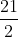
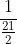

## <b> Pre-test</b>
#### Please attempt the following questions

Q 1. What is the value of the radius of gyration of disc type flywheel as compared to a rim type flywheel for the same diameter? 
a.  times 
b.  times 
c. 2 times 
<b>d.  times</b>  

Q 2. In the case of a flywheel, the maximum fluctuation energy is the 
a. ratio of the maximum and minimum energy 
b. ratio of the minimum and maximum energy 
<b>c. difference between the maximum and minimum energies</b> 
d. sum of maximum and minimum energies  

Q 3. What is the moment of inertia of disc type of flywheel? 
a. I= Mr2 
<b>b. I=0.5&lowast;Mr2</b> 
c. I=2&lowast;Mr2 
d. I=0.4&lowast;Mr2  

Q 4. Which of the following statements are correct? 
Statement A: To absorb energy when demand of energy id less than the supply 
Statement B: To give out energy when demand of energy is more than the supply. 

a. A is correct and B is wrong 
b. B is correct and A is wrong 
<b>c. Both A and B are correct</b> 
d. Both A and B are wrong  

Q 5. What is the value of the radius of gyration of the disc type flywheel as compared to rim type flywheel for the same diameter? 
a.  times 
<b>b.  times</b> 
c. 2 times 
d.  times  
