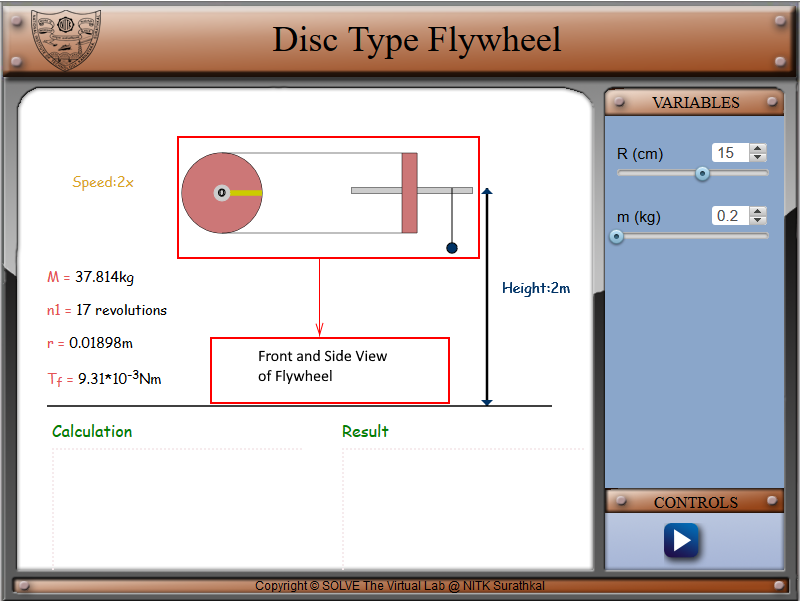
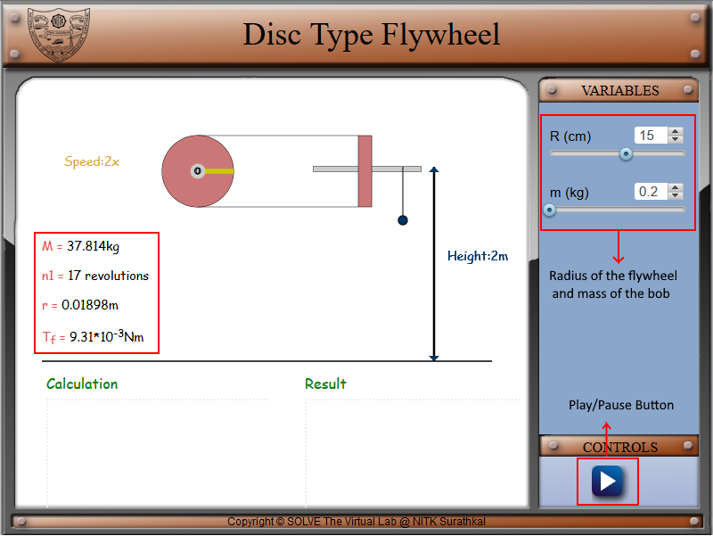
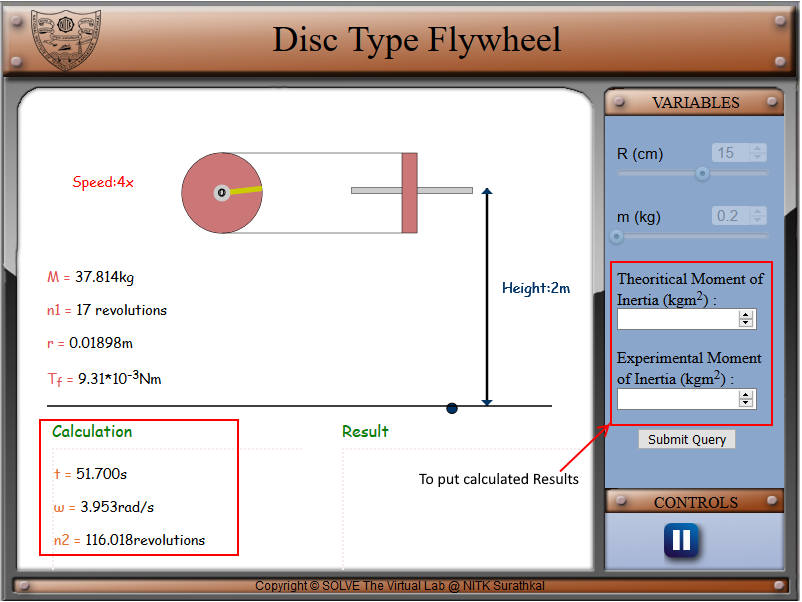
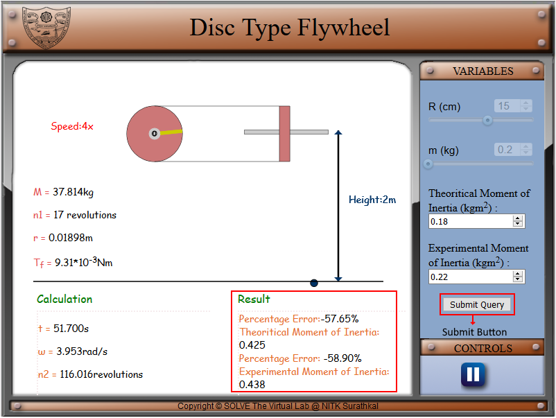

#### These procedure steps will be followed on the simulator

1. In simulation window, the experimental setup of the disc type flywheel with a string attached to the axle with mass is shown as a front view and as a side view. 
    

2. There are sliders given on right side of the screen for choosing the values of input variables, i.e., radius of the disc type flywheel (R) and mass of the metal bob (m). A play/pause button under control tab is provided to start/stop the experiment. The information about the experimental setup is given under the experimental setup. 
    

3. After initiating the simulation with the help of the play button under the control tab, two option will appear under the variable tab to enter the value of experimental and theoretical value of moment of inertia.The time required for bob to touch the ground(t), angular velocity of flywheel at the instant when the mass touches the ground(ω), number of rotations made by the flywheel after the string has left the axle (n2) is shown in the calculation column. 
    

4. Clicking on the submit button under variable tab will display the correct results under the result column with the percentage of error made by the user in calculations. 
    

5. Comparison of analytically calculated results and the error in the result with the simulation results, is displayed in the bottom of the simulator page. 
